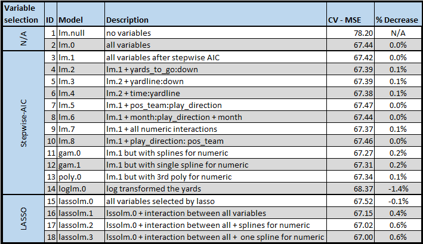
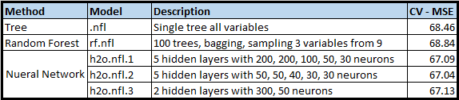

#1. Introduction

&nbsp;&nbsp;&nbsp;&nbsp;&nbsp;&nbsp; A great amount of sports information and statistics has been gathered through history and it is still being collected every day; this information is waiting to be processed and analyzed in a scientific way. As a sports fan and a sportsman, particularly football and soccer, I have always been interested in studying sports in a rigorous manner, using mathematical models and tools for better understanding the variables that come into play in these sports.

&nbsp;&nbsp;&nbsp;&nbsp;&nbsp;&nbsp; The National Football League (NFL) is one of the major professional sports leagues in North America, and the highest professional level of American football in the world. As the league competitiveness grows, teams are in continuous search for ways to have an advantage over their opponent. During any game, NFL coaches have to make very quick decisions as to what play should be executed given the situation and sometimes these decisions are based on pure "feeling"", and have a direct impact in the result of the game. The winning percentage of a team generally translates into more/less revenue, as the fan base increases/decreases. When we talk about an NFL team annual revenue we are talking about \$300 - $700 million USD[^1], and the league keeps growing every year. So, these decisions become really relevant not only in terms of winning games but also business-wise.

[^1]: According to Forbes. (http://www.forbes.com/sites/forbespr/2016/09/14/forbes-announces-19th-annual-nfl-team-valuations/#6b8ae37a2fd3)

&nbsp;&nbsp;&nbsp;&nbsp;&nbsp;&nbsp; My project consist of using NFL play-by-play data to build a predictive model to asses all possible play selection given a certain situation and determine the type of play with the higher expected number of yards.
  
&nbsp;&nbsp;&nbsp;&nbsp;&nbsp;&nbsp; I used the data for the 2009-2015 seasons. This data is available at GitHub where you can get a NFL relational database with 8 tables that contain pretty much every information collected from players and games. The database can be easily kept up to date by using the NFL's API. Even though the raw data is available, multiple queries and transformations have to be done to clean it and create a dataset with all the potentially significant variables. I used Python to do the queries to assemble the dataset I require for the model since the database comes with a Python program that simplifies the query syntax[^2].

[^2]: All python code can be found in the appendix in the section "0.1 Introduction".

&nbsp;&nbsp;&nbsp;&nbsp;&nbsp;&nbsp; The final dataset consist of 213,885 observations and the following 18 variables:  
  
- week: week within the regular season (1-17).  
- season_year: 2009-2015.  
- month: September - January.  
- drive_id: drive (possession) number within each game.  
- quarter: quarter within each game (1Q, 2Q, 3Q, 4Q, OT).  
- time: time left in seconds to play in each game (1-4500)[^3].  
- pos_team: team with ball possession/offense (32 teams).  
- pos_division: team with ball possession/offense division (8 divisions).  
- def_team: team defending (32 teams).  
- def_division: team defending division (8 divisions).  
- home: dummy variable to indicate if the team with ball possession is playing at home.  
- yardline: ball location on the field (1-99).  
- down: play down (1-4).  
- yards_to_go: yards left for first down (1-48).  
- play_type: pass or rush.  
- play_direction: 12 possible values (e.g., deep left, right tackle).  
- game_time: dummy variable to indicate if the game is played on regular time or prime time[^4].  
- yards: number of yards gained on play.  

[^3]: All games account for 900 seconds (15 minutes) of overtime.
[^4]: Prime time: games regularly played at night with national coverage.

&nbsp;&nbsp;&nbsp;&nbsp;&nbsp;&nbsp; Some things worth mentioning about the dataframe building:  
  
- All special team plays were removed (e.g., kickoff, FG, Punt).  
- All turnovers were removed (e.g., fumbles, interceptions).  
- All 'spike' plays for clock stoppage were removed.  
- All 'kneel' plays for ending half/game were removed.  

\newpage

#2. Exploratory Analysis

##2.1 Histograms, densities and barplots

&nbsp;&nbsp;&nbsp;&nbsp;&nbsp;&nbsp; I start the exploratory analysis by ploting the variables histograms. For the categorical variables I ploted the the counts of each class.

```{r Histograms, echo=FALSE, fig.height=3, fig.width=7, message=FALSE, warning=FALSE, fig.align='center'}
library(ggplot2)

load("nflgames.Rda")

nflgames$pos_team <- droplevels(nflgames$pos_team)
nflgames$home <- as.factor(nflgames$home)
nflgames$play_type <- as.factor(nflgames$play_type)


for (i in 1:ncol(nflgames)) {
  if (class(nflgames[, i])=='factor') {
    if(nlevels(nflgames[, i])>10) {
      print(ggplot(nflgames, aes(x=nflgames[,i], y=..count../sum(..count..))) + 
              geom_bar() + 
              xlab(colnames(nflgames)[i]) + 
              ylab('Proportion') + 
              coord_flip())
    } else {
      print(ggplot(nflgames, aes(x=nflgames[,i], y=..count../sum(..count..))) + 
              geom_bar() + 
              xlab(colnames(nflgames)[i]) + 
              ylab('Proportion'))
    }
  } else {
    print(ggplot(nflgames, aes(x=nflgames[,i], y=..count../sum(..count..))) + 
            geom_histogram(col='black', fill='lightgrey') + 
            xlab(colnames(nflgames)[i]) + 
            ylab('Proportion'))
  }
}
```

&nbsp;&nbsp;&nbsp;&nbsp;&nbsp;&nbsp; Some things worth mentioning are:  
- The number of plays right before the end of the 2nd and 4th quarter are higher than any other time in a game.  
- The most common starting point of all drives is at the 20 yardline.  
- The league is clearly a passing play league.  
- The direction of rushing plays is greatly dominated by "left tackle" runs.  

## 2.2 Marginal effects

&nbsp;&nbsp;&nbsp;&nbsp;&nbsp;&nbsp; To look at the marginal effect of each variable with the response I ploted the variables versus the response ('yards'). In the case of the categorical variables I used boxplots and densities by value.

```{r Marginal effects, echo=FALSE, fig.height=3, fig.width=7, message=FALSE, warning=FALSE, fig.align='center'}
library(gridExtra)

for (i in 1:ncol(nflgames)){
  if (class(nflgames[,i])=='factor'){
    temp.plot1 <- ggplot(nflgames, 
                         aes_string(x=factor(1), 
                                    y=colnames(nflgames)[17], 
                                    col=colnames(nflgames)[i])) + 
      geom_boxplot() +
      theme(legend.position = "none") + 
      xlab('')
    temp.plot2 <- ggplot(nflgames, 
                         aes_string(x=colnames(nflgames)[17], 
                                    col=colnames(nflgames)[i])) + 
      geom_density()
    
    print(grid.arrange(temp.plot1, temp.plot2, ncol=2))
    
  } else {
    
    print(ggplot(nflgames, aes_string(x = nflgames[,i], y = nflgames[,17])) + geom_point() + xlab(colnames(nflgames)[i]) + ylab('yards'))
    
  }
}
```

&nbsp;&nbsp;&nbsp;&nbsp;&nbsp;&nbsp; Some things worth mentioning are:  

- A lot of variables appear to be not significant in the number of yards.  
- The variables that appear to be "most significant" are the play_type and play_direction.  

## 2.3 Correlation matrix

&nbsp;&nbsp;&nbsp;&nbsp;&nbsp;&nbsp; To understand in more detail the relationship between numeric variables I looked at the correlation matrix.  

```{r Correlation matrix, echo=FALSE, fig.height=3, fig.width=7, message=FALSE, warning=FALSE, fig.align='center'}
library(corrplot)

numeric.var <- sapply(nflgames, is.numeric)

corrplot(cor(nflgames[,numeric.var]), method = "number", number.cex = 0.7)

```

&nbsp;&nbsp;&nbsp;&nbsp;&nbsp;&nbsp; No numeric variable has an important correlation with the number of yards. The drive_id and time variables are highly correlated since as the drive_id increases less time left in the game there is.

## 2.4 Principal components

&nbsp;&nbsp;&nbsp;&nbsp;&nbsp;&nbsp; I performed principal components analysis to understand the relationship between the variables and try to reduce the dimension. For this analysis I worked with a sample of 500 observations to avoid computational problems.

```{r PCA, echo=FALSE, fig.height=3, fig.width=7, message=FALSE, warning=FALSE, fig.align='center'}
load("nflgames.sample.Rda")

for (i in 1:ncol(nflgames.sample)){
  if (class(nflgames.sample[,i])=='factor'){
    nflgames.sample[,i] <- as.integer(nflgames.sample[,i])
  }
}

nflgames.sample <- scale(nflgames.sample)

pc_fit <- princomp(nflgames.sample, cor = TRUE)

plot(pc_fit, type = "lines")

```

&nbsp;&nbsp;&nbsp;&nbsp;&nbsp;&nbsp; The "elbow" in the scree plot is formed at the second principal component. These two principal components explain ~26% of the variance. To understand better the PC's we can look at the biplot.

```{r PCA II, echo=FALSE, fig.height=3, fig.width=7, message=FALSE, warning=FALSE, fig.align='center'}
biplot(pc_fit, cex=0.5)
```

&nbsp;&nbsp;&nbsp;&nbsp;&nbsp;&nbsp; We can see in the plot that the most important variables in the principal components are the time related variables, play_type and play_direction. In this particular case, satisfactory dimension reduction is not achieved since no small number of principal components explain an important amount of the variance.

## 2.5 Clustering

&nbsp;&nbsp;&nbsp;&nbsp;&nbsp;&nbsp; To better understand the relationship between the variables I performed hierarchical and k-means clustering. For these analyses I used a sample of 500 observations to avoid computational problems.

### 2.5.1 Hierarchical clustering

&nbsp;&nbsp;&nbsp;&nbsp;&nbsp;&nbsp; Using complete linkage and manhattan distance I got the following results.

```{r Hierarchical clustering, echo=FALSE, fig.height=3, fig.width=7, message=FALSE, warning=FALSE, fig.align='center'}
manh_dis <- dist(nflgames.sample, method = "manhattan")
hclust_complete <- hclust(manh_dis,method = "complete")
plot(hclust_complete, cex=0.001)
rect.hclust(hclust_complete, k=2, border="red")
```

&nbsp;&nbsp;&nbsp;&nbsp;&nbsp;&nbsp; To understand the main difference between the two biggest clusters I ploted the density of each variable.

```{r Hierarchical clustering II, echo=FALSE, fig.height=3, fig.width=7, message=FALSE, warning=FALSE, fig.align='center'}
library(reshape)

obs_groups2 <- cutree(hclust_complete,k=2)

nflgames.melt <- melt(nflgames.sample)

nflgames.melt2 <- cbind(nflgames.melt, obs_groups2)

nflgames.melt2$obs_groups2 <- as.factor(nflgames.melt2$obs_groups2)

ggplot(nflgames.melt2, aes(x = value, col = obs_groups2)) + geom_density() +
  facet_wrap( ~ X2, scales = "free")
```

&nbsp;&nbsp;&nbsp;&nbsp;&nbsp;&nbsp; The main difference between the clusters can be seen in the 'time' variable. The majority of observations from one cluster are from the first half of the game while the other cluster has the majority of observations from the second half and overtime. 

### 2.5.2 K-means clustering

&nbsp;&nbsp;&nbsp;&nbsp;&nbsp;&nbsp; To determine the number of clusters I ran the algorithm with different values and ploted their corresponding within sum of squares.

```{r k-means, echo=FALSE, fig.height=3, fig.width=7, message=FALSE, warning=FALSE, fig.align='center'}
allss <- c()
for(k in c(1,2,3,4,5,6,7,8,9,10)){
  temp_k <- kmeans(x = nflgames.sample,centers=k,nstart = 20)
  allss <- c(allss,sum(temp_k$withinss))
}
plot(c(1,2,3,4,5,6,7,8,9,10),allss)
```
&nbsp;&nbsp;&nbsp;&nbsp;&nbsp;&nbsp; As we can see in the plot, there is a big drop in the second cluster, but after that the decrease is gets smaller and smaller. That why I used 2 clusters for this analysis.

&nbsp;&nbsp;&nbsp;&nbsp;&nbsp;&nbsp; Again, to understand the main difference between the two clusters I ploted the density of each variable.

```{r k-means II, echo=FALSE, fig.height=3, fig.width=7, message=FALSE, warning=FALSE, fig.align='center'}

k3 <- kmeans(x = nflgames.sample, centers=2, nstart = 20)

nflgames.melt5 <- cbind(nflgames.melt, clust=k3$cluster)

nflgames.melt5$clust <- as.factor(nflgames.melt5$clust)

ggplot(nflgames.melt5, aes(x = value, col = clust)) + 
  geom_density() + 
  facet_wrap( ~ X2, scales = "free")
```

&nbsp;&nbsp;&nbsp;&nbsp;&nbsp;&nbsp; The results are very similar to those obtained with hierarchical clustering. The main difference between clusters is related to time. One cluster has the first half plays and the other cluster has the second half plays. This clusters are not very useful as the difference between them is based on the structure of the game.


##2.6 High-dimensional Undirected Graph Estimation

&nbsp;&nbsp;&nbsp;&nbsp;&nbsp;&nbsp; A way to describe the conditional independence among variables is using undirected graphs. I used the 'huge' package to better understand the relationship between the covariates.

```{r huge I, echo=FALSE, fig.height=3, fig.width=7, message=FALSE, warning=FALSE, fig.align='center'}
library(huge)

nflgames.huge <- nflgames[,-17]

for (i in 1:ncol(nflgames.huge)){
  if (class(nflgames.huge[,i])=='factor'){
    nflgames.huge[,i] <- as.numeric(nflgames.huge[,i])
  }
  
}

h.nfl <- huge(as.matrix(nflgames.huge))
plot.huge(h.nfl)
```

&nbsp;&nbsp;&nbsp;&nbsp;&nbsp;&nbsp; In the previous graphs we can see different undirected graphs (were each node is a variable in the dataframe) for different regularization parameters that control the sparcity level (lambda). If there are no edges between the nodes it implies that the variables are conditional independent given all of the other variables.

&nbsp;&nbsp;&nbsp;&nbsp;&nbsp;&nbsp; To see which variables the graph is refering to as conditional independent lets look at the adjacency matrix corresponding to lambda=0.438.

```{r huge II, echo=FALSE, fig.height=3, fig.width=7, message=FALSE, warning=FALSE, fig.align='center'}

h.nfl1 <- huge(as.matrix(nflgames.huge), lambda = 0.438)
h.nfl1$path[[1]]
```

&nbsp;&nbsp;&nbsp;&nbsp;&nbsp;&nbsp; The previous matrix tells us that there is a certain dependencie between the following variables:  

- week and month (1,3).  
- drive_id, quarter, and time (4,5,6).  
- pos_division and def_division (10,11).  
- play_type and play_direction (15,16).  

&nbsp;&nbsp;&nbsp;&nbsp;&nbsp;&nbsp; These dependencies make a lot of sense. Week and month are both variables regarding the time of the year. Drive_id, quarter, and time are all variables of time within a game. Pos_division and def_division are the corresponding divisions of the teams playing, which games within same divisions are more numerous. Play_type and play_direction, the subset of values of play_direction depend on the play_type.

&nbsp;&nbsp;&nbsp;&nbsp;&nbsp;&nbsp; If we set a very low value for lambda we get a graph where all nodes are connected.

```{r huge III, echo=FALSE, fig.height=3, fig.width=7, message=FALSE, warning=FALSE, fig.align='center'}

h.nfl2 <- huge(as.matrix(nflgames.huge), lambda = 0.00001)
huge.plot(h.nfl2$path[[1]])
```

\newpage

#3. Methodology

&nbsp;&nbsp;&nbsp;&nbsp;&nbsp;&nbsp; The first thing I did was to fit a linear model with all the variables to have a baseline for comparison.

&nbsp;&nbsp;&nbsp;&nbsp;&nbsp;&nbsp; The next step was variable selection. I used three methods for variable selection, forward stepwise, backward stepwise and LASSO. In both stepwise methods the results were the same, a total of 9 variables were selected (play_direction, yardline, yards_to_go, pos_team, def_team, home, quarter, time, down).

&nbsp;&nbsp;&nbsp;&nbsp;&nbsp;&nbsp; In the case of LASSO the results were different.

```{r LASSO CV, echo=FALSE, fig.height=3, fig.width=7, message=FALSE, warning=FALSE, fig.align='center'}
library(glmnet)

nflgames.matrix <- model.matrix(yards ~ ., data = nflgames)

lasso.cv <- cv.glmnet(x = nflgames.matrix, 
                      y = as.matrix(nflgames$yards), 
                      alpha = 1)

plot(lasso.cv)
```

&nbsp;&nbsp;&nbsp;&nbsp;&nbsp;&nbsp; As we can see in the previous graph, the minimum MSE is achieved when using all variables. But reducing the number of variables dramatially to 9 only has a minimal impact in the MSE (the 9 variables are condensed into 3 because of the levels of the categorical variable, the variables are play_direction, yardline, yards_to_go).

&nbsp;&nbsp;&nbsp;&nbsp;&nbsp;&nbsp; After performing these variable selection methods I decided to have two model blocks:  

1. Stepwise models: models using the variables selected by the stepwise methods (9 variables).  
1. LASSO models: models using the variables selected by LASSO (3 variables).  

&nbsp;&nbsp;&nbsp;&nbsp;&nbsp;&nbsp; Even though the relationship between the covariates and the response is not clearly non-linear I tried some transformations in order to attempt to improve the predicting porwer of the model. I tried using polynomials, splines, log transforming the response, and adding interaction terms.

&nbsp;&nbsp;&nbsp;&nbsp;&nbsp;&nbsp; After building a lot of models I chose one of the best in terms of cross-validation MSE and checked its diagnostics.

```{r Diagnostics best, echo=FALSE, fig.height=3, fig.width=7, message=FALSE, warning=FALSE, fig.align='center'}

lassolm.1 <- lm(yards ~ play_direction + yardline + yards_to_go +
                  play_direction:yardline + yards_to_go:play_direction + 
                  yardline:yards_to_go, 
                 data=nflgames)

plot(lassolm.1)
```

&nbsp;&nbsp;&nbsp;&nbsp;&nbsp;&nbsp; Clearly, all assumptions are not met. There is a clear problem of heteroskedasticity as the residuals increase as the fitted value increases, and we can see there are some "sections" where multiple cones are formed. There are some arcs in the standarized residuals plot which I think they are explained because the response can only take integer values. Also in the QQ-plot we can see we have extremly large tails.

&nbsp;&nbsp;&nbsp;&nbsp;&nbsp;&nbsp; Trying to deal with these problems I fitted a quatile regression and weighted each observation with their variance.

```{r quantile regression, echo=FALSE, fig.height=3, fig.width=7, message=FALSE, warning=FALSE, fig.align='center'}
library(quantreg)

lassolm.1.quant <- rq(yards ~ play_direction + play_direction:yardline + 
                   yards_to_go + yardline + yards_to_go:play_direction, 
                   tau = 0.9,
                   weights = 1/abs(lassolm.1$residuals),
                   data=nflgames)


plot(lassolm.1.quant$fitted.values,lassolm.1.quant$residuals)
plot(lassolm.1.quant$fitted.values,sqrt(abs(lassolm.1.quant$residuals)))
qqnorm(lassolm.1.quant$residuals)
qqline(lassolm.1.quant$residuals)
```

&nbsp;&nbsp;&nbsp;&nbsp;&nbsp;&nbsp; We can see that there was a vary small improvement in terms of heteroskedasticity but the QQ-plot got worse.

&nbsp;&nbsp;&nbsp;&nbsp;&nbsp;&nbsp; Even though the normality assumption is not met I built the confidence intervals for each parameter (for model lassolm.1). For comparison I also built the confidence intervals using the bootstrap percentile method. Of all 40 intervals, 27 include the value zero and only in 9 the normal intervals are smaller than the bootstrap intervals. Here we can look at some intervals:

```{r CI, echo=FALSE, fig.height=3, fig.width=7, message=FALSE, warning=FALSE, fig.align='center'}
library(dplyr)
library(boot)

norm.int <- as.data.frame(confint(lassolm.1))

norm.int <- mutate(norm.int, leng.ci.norm= norm.int[,2]-norm.int[,1])

norm.int <- mutate(norm.int, zero.norm = ifelse((norm.int[,2] & 0>norm.int[,1]),1,0))

colnames(norm.int) <- c("Normal 2.5 %","Normal 97.5 %","Normal Interval Length", "zero.norm")

load("b1.Rda")

ALPHA <- 0.05

ci_boot <- matrix(0,ncol = 2,nrow = 40)
for (i in 1:40){
  ci_boot[i,] <- boot.ci(b1, index = i, conf = 1-ALPHA, type = "perc")$percent[,c(4,5)]
}

ci_boot <- as.data.frame(ci_boot)

ci.length <- mutate(ci_boot, leng.ci.boot=ci_boot[,2]-ci_boot[,1])

ci.length <- mutate(ci.length, zero.boot= ifelse((ci_boot[,2] & 0>ci_boot[,1]),1,0))

colnames(ci.length) <- c("Boot 2.5 %","Boot 97.5 %","Boot Interval Length", "zero.boot")

both <- cbind(norm.int, ci.length)

both[c(1,15,25,30), c(1,2,3,5,6,7)]

```

&nbsp;&nbsp;&nbsp;&nbsp;&nbsp;&nbsp; In addition to the previous models I fitted multiple random forests and neural networks.

&nbsp;&nbsp;&nbsp;&nbsp;&nbsp;&nbsp; In the case of random forest I tried the following variations using the 'tree' and 'randomForest' packages:  

- Single tree: a single tree using all the covariates.
- Random forest: 100 trees using bagging and sampling 3 covariates from 9 covariates (stepwise selection).

&nbsp;&nbsp;&nbsp;&nbsp;&nbsp;&nbsp; For neural networks I used the 'h2o' package and tried the following variations:  

- 5 hidden layers with 200, 200, 100, 50, and 30 neurons.
- 5 hidden layers with 50, 50, 40, 30, and 30 neurons.
- 2 hidden layers with 300, 50

\newpage

#4. Results

&nbsp;&nbsp;&nbsp;&nbsp;&nbsp;&nbsp;  The following table is a summary of all fitted models with a brief description[^5], their corresponding 10 fold cross-validation MSE, and the percentage decrease in terms of CV-MSE with respect to the complete model.

[^5]: The full formula for each model can be found in the appendix in the section "0.4 Results".

&nbsp;&nbsp;&nbsp;&nbsp;&nbsp;&nbsp; It is worth mentioning that for the models with transformed responses a different cross-validation formula was coded[^6] to return the predictions to the original scale so they could be compared to the other models.

[^6]: The code can be found in the appendix section "0.4 Results".



&nbsp;&nbsp;&nbsp;&nbsp;&nbsp;&nbsp; The next table is the summary for the additional methods used in the project.



&nbsp;&nbsp;&nbsp;&nbsp;&nbsp;&nbsp; As we can see from the previous tables the best model is 'lassolm.3'. A model with the folowing formula:

yards ~ play_direction + s(yardline, yards_to_go) + play_direction:yardline + play_direction:yards_to_go + yardline:yards_to_go


\newpage

#5. Conclusions

&nbsp;&nbsp;&nbsp;&nbsp;&nbsp;&nbsp; After all the analyses done, the end-model has a CV-MSE of +-8 yards which is useless for the purpose of play selection under different circumstances. As we saw, the model clearly violates the homoskedasticity and normality assumptions.

&nbsp;&nbsp;&nbsp;&nbsp;&nbsp;&nbsp; The marginal effect plots and the correlation between the variables were early indications that the model was not going to be as powerful in predicting the number of yards.

&nbsp;&nbsp;&nbsp;&nbsp;&nbsp;&nbsp; Unfortunately, the additional exploratory analysis such as clustering and principal components did not share any additional information or 'hidden' structure within the data.

&nbsp;&nbsp;&nbsp;&nbsp;&nbsp;&nbsp; This result tells us that the game is much more complicated and cannot be explained or summarized by 18 variables. Many variables that could explain the game better are not within our model. Additional variables such as weather, roster, a type of roster score, score or score differential, etc., could be added an see if the model improves.

&nbsp;&nbsp;&nbsp;&nbsp;&nbsp;&nbsp; Some interesting findings and unexpected statistics where that there is a clear difference between a runing play through the left tackle versus all other options.

\newpage

#0. Appendix

##0.1 Introduction

Python code to build dataframe.

```{python, eval=FALSE}
import nfldb
import re

f=open('nflgames.txt','w')
f.write('gsis_id, week ,day_of_week, season_year, month, start_time, drive_id, play_id,' +
        'quarter, time, pos_team, def_team, home, pos_division, def_division,location,' +
        'yardline, down, yards_to_go, description, note, pass_id, rush_id, error_id,' + 
        'rush_direction, pass_direction, yards' +
        '\n')

exclude=['KICKOFF','XP','PUNT','PUNTB','FG','TIMEOUT','XPM','XPB','XPA','PENALTY',
         'FUMBLE','Timeout','FGM','FGB','2PR']

afc_south=['HOU','IND','TEN','JAX']
afc_east=['NE','MIA','BUF','NYJ']
afc_west=['OAK','KC','DEN','SD']
afc_north=['BAL','PIT','CIN','CLE']

nfc_east=['DAL','NYG','WAS','PHI']
nfc_west=['SEA','ARI','SF','STL']
nfc_north=['DET','MIN','GB','CHI']
nfc_south=['ATL','TB','NO','CAR']

years=['2009','2010','2011','2012','2013','2014','2015']

for i in years:
    db = nfldb.connect()
    q=nfldb.Query(db).game(season_year=i, season_type="Regular")

    for play in q.as_plays():
    # To avoid unnecessary observations the following code will rEmove them
        if play.note in exclude:
            continue
        if re.search('INTERCEPTED',str(play.description)):
            continue
        if re.search('END QUARTER',str(play.description)):
            continue
        if re.search('End of quarter',str(play.description)):
            continue
        if re.search('END GAME',str(play.description)):
            continue
        if re.search('End of game',str(play.description)):
            continue
        if re.search('End of half',str(play.description)):
            continue
        if re.search('Timeout',str(play.description)):
            continue
        if re.search('Punt formation',str(play.description)):
            continue
        if re.search('kicks',str(play.description)):
            continue
        if re.search('REVERSED',str(play.description)):
            continue
        if re.search('Two-Minute Warning',str(play.description)):
            continue
        if re.search('TWO-POINT CONVERSION',str(play.description)):
            continue
        if re.search('kneels',str(play.description)):
            continue
        if re.search('spiked',str(play.description)):
            continue
        if re.search('punts',str(play.description)):
            continue
        if re.search('punt is BLOCKED',str(play.description)):
            continue
        if re.search('field goal is BLOCKED',str(play.description)):
            continue
        if re.search('Field Goal',str(play.description)):
            continue
        if re.search('FUMBLES',str(play.description)):
            continue
        if re.search('\*\*\* play under review \*\*\*',str(play.description)):
            continue

    #The following code extracts the quarter and the time left
        time = str(play.time)
        quarter = time[:2]
        minutes = time[3:5]
        if minutes[0]==0:
            minutes=int(minutes[1])
        else:
            try:
                minutes=int(minutes)
            except:
                minutes=0
        try:
            seconds = time[6:]
            if seconds[0]==0:
                seconds = int(seconds[1])
            else:
                try: seconds=int(seconds)
                except: seconds=0
        except:
            seconds=0

        desc=str(play.description)

        if (minutes==0 and seconds==0):
            if re.findall('^\((.*?)\)',desc)[0]=='15:00':
                if quarter=='Q1':
                    time=15*60+3600
                elif quarter=='Q2':
                    time=15*60+45*60
                elif quarter=='Q3':
                    time=15*60+30*60
                elif quarter=='Q4':
                    time=15*60+15*60
                else:
                    time=15*60
            else:
                if quarter=='Q1':
                    time=3600
                elif quarter=='Q2':
                    time=45*60
                elif quarter=='Q3':
                    time=30*60
                elif quarter=='Q4':
                    time=15*60
                else:
                    time=0
        else:
            if quarter=='Q1':
                time=minutes*60+seconds+3600
            elif quarter=='Q2':
                time=minutes*60+seconds+45*60
            elif quarter=='Q3':
                time=minutes*60+seconds+30*60
            elif quarter=='Q4':
                time=minutes*60+seconds+15*60
            else:
                time=minutes*60+seconds

    #The following code extracts the location of the ball (e.g. "OWN" OR "OPP" and yardline)
        yardline=str(play.yardline)
        if yardline=='N/A':
            location='N/A'
            yardline='N/A'
        elif yardline=='MIDFIELD':
            location='OPP'
            yardline='50'
        else:
            location=yardline[:3]
            yardline=yardline[4:]

    #The following code extracts each game general info
        gameid=play.gsis_id
        q1=nfldb.Query(db).game(gsis_id=gameid)
        hometeam=q1.as_games()[0].home_team
        awayteam=q1.as_games()[0].away_team
        week=q1.as_games()[0].week
        day_of_week=q1.as_games()[0].day_of_week
        season_year=q1.as_games()[0].season_year
        start_time=str(q1.as_games()[0].start_time)
        month=start_time[5:7]
        start_time=start_time[11:]
        if play.pos_team==hometeam:
            def_team=awayteam
            home=1
        else:
            def_team=hometeam
            home=0

        if play.pos_team in afc_east:
            pos_division='AFC-EAST'
        elif play.pos_team in afc_west:
            pos_division='AFC-WEST'
        elif play.pos_team in afc_north:
            pos_division='AFC-NORTH'
        elif play.pos_team in afc_south:
            pos_division='AFC-SOUTH'
        elif play.pos_team in nfc_east:
            pos_division='NFC-EAST'
        elif play.pos_team in nfc_west:
            pos_division='NFC-WEST'
        elif play.pos_team in nfc_north:
            pos_division='NFC-NORTH'
        elif play.pos_team in nfc_south:
            pos_division='NFC-SOUTH'

        if def_team in afc_east:
            def_division='AFC-EAST'
        elif def_team in afc_west:
            def_division='AFC-WEST'
        elif def_team in afc_north:
            def_division='AFC-NORTH'
        elif def_team in afc_south:
            def_division='AFC-SOUTH'
        elif def_team in nfc_east:
            def_division='NFC-EAST'
        elif def_team in nfc_west:
            def_division='NFC-WEST'
        elif def_team in nfc_north:
            def_division='NFC-NORTH'
        elif def_team in nfc_south:
            def_division='NFC-SOUTH'

    #The following code extracts all the details of each play from the play description
        if re.search('Shotgun', desc):
            shotgun=1
        else:
            shotgun=0

        if re.search('No Huddle', desc):
            no_huddle=1
        else:
            no_huddle=0

        if re.search('pass', desc):
            pass_id=1
            rush_id=0
            error_id=0
            rush_direction='N/A'
            if re.search('short right', desc):
                pass_direction='short right'
                if re.search('incomplete', desc):
                    yards=0
                elif re.search('for no gain', desc):
                    yards=0
                else:
                    yards=re.findall('for (.*?) yard', desc)[0]
            elif re.search('short middle', desc):
                pass_direction='short middle'
                if re.search('incomplete', desc):
                    yards=0
                elif re.search('for no gain', desc):
                    yards=0
                else:
                    yards=re.findall('for (.*?) yard', desc)[0]
            elif re.search('short left', desc):
                pass_direction='short left'
                if re.search('incomplete', desc):
                    yards=0
                elif re.search('for no gain', desc):
                    yards=0
                else:
                    yards=re.findall('for (.*?) yard', desc)[0]
            elif re.search('deep right', desc):
                pass_direction='deep right'
                if re.search('incomplete', desc):
                    yards=0
                elif re.search('for no gain', desc):
                    yards=0
                else:
                    yards=re.findall('for (.*?) yard', desc)[0]
            elif re.search('deep middle', desc):
                pass_direction='deep middle'
                if re.search('incomplete', desc):
                    yards=0
                elif re.search('for no gain', desc):
                    yards=0
                else:
                    yards=re.findall('for (.*?) yard', desc)[0]
            elif re.search('deep left', desc):
                pass_direction='deep left'
                if re.search('incomplete', desc):
                    yards=0
                elif re.search('for no gain', desc):
                    yards=0
                else:
                    yards=re.findall('for (.*?) yard', desc)[0]
        elif re.search('scrambles', desc):
            pass_id=0
            rush_id=1
            error_id=0
            if re.search('for no gain', desc):
                yards=0
            else:
                yards=re.findall('for (.*?) yard', desc)[0]
            pass_direction='N/A'
            rush_direction='Scrambles'
        elif re.search('sacked', desc):
            pass_id=1
            rush_id=0
            error_id=0
            try:
                yards=re.findall('for (.*?) yard', desc)[0]
            except:
                print desc
                yards=0
            pass_direction='N/A'
            rush_direction='N/A'
        elif re.search('up the middle', desc):
            pass_id=0
            rush_id=1
            error_id=0
            rush_direction='center'
            if re.search('for no gain', desc):
                yards=0
            else:
                yards=re.findall('for (.*?) yard', desc)[0]
            pass_direction='N/A'
        elif re.search('right guard', desc):
            pass_id=0
            rush_id=1
            error_id=0
            rush_direction='right guard'
            if re.search('for no gain', desc):
                yards=0
            else:
                yards=re.findall('for (.*?) yard', desc)[0]
            pass_direction='N/A'
        elif re.search('right tackle', desc):
            pass_id=0
            rush_id=1
            error_id=0
            rush_direction='right tackle'
            if re.search('for no gain', desc):
                yards=0
            else:
                yards=re.findall('for (.*?) yard', desc)[0]
            pass_direction='N/A'
        elif re.search('right end', desc):
            pass_id=0
            rush_id=1
            error_id=0
            rush_direction='left tackle'
            if re.search('for no gain', desc):
                yards=0
            else:
                yards=re.findall('for (.*?) yard', desc)[0]
            pass_direction='N/A'
        elif re.search('left guard', desc):
            pass_id=0
            rush_id=1
            error_id=0
            rush_direction='left guard'
            if re.search('for no gain', desc):
                yards=0
            else:
                yards=re.findall('for (.*?) yard', desc)[0]
            pass_direction='N/A'
        elif re.search('left tackle', desc):
            pass_id=0
            rush_id=1
            error_id=0
            rush_direction='left tackle'
            if re.search('for no gain', desc):
                yards=0
            else:
                yards=re.findall('for (.*?) yard', desc)[0]
            pass_direction='N/A'
        elif re.search('left end', desc):
            pass_id=0
            rush_id=1
            error_id=0
            rush_direction='left tackle'
            if re.search('for no gain', desc):
                yards=0
            else:
                yards=re.findall('for (.*?) yard', desc)[0]
            pass_direction='N/A'
        else:
            pass_id=0
            rush_id=1
            error_id=1
            try:
                yards=re.findall('for (.*?) yard', desc)[0]
            except:
                yards=0
            rush_direction='Unk'
            pass_direction='N/A'

        try:
            yards=int(yards)
        except:
            yards=int(yards.rsplit(' ',1)[1])

        #print pass_id, rush_id, yards, play.play_id
        f.write(str(play.gsis_id) + ',' + str(week) + ',' + str(day_of_week) + ',' + 
                str(season_year) + ',' + str(month)+ ',' + str(start_time) + ',' +
                str(play.drive_id) + ',' + str(play.play_id) + ',' + str(quarter) + ',' + 
                str(time) + ',' + str(play.pos_team) + ',' + str(def_team) + ',' + 
                str(home) + ',' + str(pos_division) + ',' + str(def_division) + ',' + 
                str(location) + ',' + str(yardline) + ',' + str(play.down) + ',' + 
                str(play.yards_to_go) + ',' + str(play.description).replace(',','.') + ',' + 
                str(play.note) + ',' + str(pass_id) + ',' + str(rush_id) + ',' + 
                str(error_id) + ',' + str(rush_direction) + ',' + str(pass_direction) + ',' + 
                str(yards) +
                '\n' )

```

R code to clean and transform data.

```{r, eval=FALSE}
nflgames <- read.csv("nflgames.txt")

#Remove the remaining errors

nflgames_err <- subset(nflgames, error_id==1)
nflgames_err <- subset(nflgames_err, yards==0)
no_gain_plays <- grep('for no gain',nflgames_err[,20])
names_row <- as.integer(row.names(nflgames_err[-no_gain_plays,]))
nflgames <- nflgames[-names_row,]
str(nflgames)
nflgames$yardline <- as.integer(nflgames$yardline)
nflgames$month <- as.factor(nflgames$month)
nflgames$down <- as.factor(nflgames$down)

#transformations (yardline)

ind_1 <- (nflgames$location=='OPP' & nflgames$yardline==50)

nflgames$location[ind_1] <- 'OWN'

ind_2 <- (nflgames$location=='OPP')

nflgames$yardline[ind_2] <- 100-nflgames$yardline[ind_2]

#~29 erros on ball location, the following code corrects it

ind_3 <- ((110-nflgames$yardline)<(nflgames$yards))

nflgames$yardline[ind_3] <- (100-nflgames$yards[ind_3] )

#transformation start_time

prime <- c("19:00:00-04:00","19:00:00-05:00","19:10:00-04:00","19:20:00-05:00",
           "19:30:00-05:00","20:00:00-05:00","20:20:00-04:00","20:20:00-05:00",
           "20:25:00-04:00","20:25:00-05:00","20:30:00-04:00","20:30:00-05:00",
           "20:40:00-04:00","20:40:00-05:00","21:30:00-04:00","22:15:00-04:00",
           "22:20:00-04:00","23:35:00-04:00")

ind_3 <- (nflgames$start_time %in% prime)

nflgames$game_time <- 'Regular'
nflgames$game_time[ind_3] <- 'Prime'
nflgames$game_time <- as.factor(nflgames$game_time)

# merging pass_id and rush_id and directions

nflgames$pass_direction <- as.character(nflgames$pass_direction)
nflgames$rush_direction <- as.character(nflgames$rush_direction)

ind_4 <- (nflgames$rush_id==1)

nflgames$pass_direction[ind_4] <- nflgames$rush_direction[ind_4] 

ind_5 <- (nflgames$pass_id==1 & nflgames$pass_direction=='N/A')

nflgames$pass_direction[ind_5] <- 'Sack'

ind_6 <- (nflgames$pass_direction=='Sack' & nflgames$yards>0)

nflgames$pass_direction[ind_6] <- 'Unk'

nflgames$pass_direction <- as.factor(nflgames$pass_direction)

nflgames <- subset(nflgames, pass_direction!='Unk')

#remove unnecesary variables (gsis_id, play_id, description, note, error_id, 
#location, start_time, day_of_week, rush_id, rush_direction)

remove_var <- c('gsis_id', 'play_id', 'description', 'note', 'error_id', 
                'location', 'start_time', 'day_of_week', 'rush_id', 'rush_direction')

nflgames <- nflgames[,-which(names(nflgames) %in% remove_var)]

colnames(nflgames)[15] <- 'play_type'

colnames(nflgames)[16] <- 'play_direction'

save(nflgames,file="nflgames.Rda")

```


##0.2 Exploratory Analysis

###0.2.1 Histograms, densities and barplots

```{r, eval=FALSE}
library(ggplot2)

load("nflgames.Rda")

nflgames$pos_team <- droplevels(nflgames$pos_team)
nflgames$home <- as.factor(nflgames$home)
nflgames$play_type <- as.factor(nflgames$play_type)


for (i in 1:ncol(nflgames)) {
  if (class(nflgames[, i])=='factor') {
    if(nlevels(nflgames[, i])>10) {
      print(ggplot(nflgames, aes(x=nflgames[,i], y=..count../sum(..count..))) + 
              geom_bar() + 
              xlab(colnames(nflgames)[i]) + 
              ylab('Proportion') + 
              coord_flip())
    } else {
      print(ggplot(nflgames, aes(x=nflgames[,i], y=..count../sum(..count..))) + 
              geom_bar() + 
              xlab(colnames(nflgames)[i]) + 
              ylab('Proportion'))
    }
  } else {
    print(ggplot(nflgames, aes(x=nflgames[,i], y=..count../sum(..count..))) + 
            geom_histogram(col='black', fill='lightgrey') + 
            xlab(colnames(nflgames)[i]) + 
            ylab('Proportion'))
  }
}
```

###0.2.2 Marginal effects

```{r, eval=FALSE}
library(gridExtra)

for (i in 1:ncol(nflgames)){
  if (class(nflgames[,i])=='factor'){
    temp.plot1 <- ggplot(nflgames, 
                         aes_string(x=factor(1), 
                                    y=colnames(nflgames)[17], 
                                    col=colnames(nflgames)[i])) + 
      geom_boxplot() +
      theme(legend.position = "none") + 
      xlab('')
    temp.plot2 <- ggplot(nflgames, 
                         aes_string(x=colnames(nflgames)[17], 
                                    col=colnames(nflgames)[i])) + 
      geom_density()
    
    print(grid.arrange(temp.plot1, temp.plot2, ncol=2))
    
  } else {
    
    print(ggplot(nflgames, aes_string(x = nflgames[,i], y = nflgames[,17])) + 
            geom_point() + 
            xlab(colnames(nflgames)[i]) + 
            ylab('yards'))
    
  }
}
```

###0.2.3 Correlation matrix

```{r, eval=FALSE}
library(corrplot)

numeric.var <- sapply(nflgames, is.numeric)

corrplot(cor(nflgames[,numeric.var]), method = "number", number.cex = 0.7)

```

###0.2.4 Principal components

```{r, eval=FALSE}
load("nflgames.sample.Rda")

for (i in 1:ncol(nflgames.sample)){
  if (class(nflgames.sample[,i])=='factor'){
    nflgames.sample[,i] <- as.integer(nflgames.sample[,i])
  }
}

nflgames.sample <- scale(nflgames.sample)

pc_fit <- princomp(nflgames.sample, cor = TRUE)

plot(pc_fit, type = "lines")

```

```{r, eval=FALSE}
biplot(pc_fit, cex=0.5)
```

###0.2.5 Clustering

####0.2.5.1 Hierarchical clustering

```{r, eval=FALSE}
manh_dis <- dist(nflgames.sample, method = "manhattan")
hclust_complete <- hclust(manh_dis,method = "complete")
plot(hclust_complete, cex=0.001)
rect.hclust(hclust_complete, k=2, border="red")
```

```{r, eval=FALSE}
obs_groups2 <- cutree(hclust_complete,k=2)

nflgames.melt <- melt(nflgames.sample)

nflgames.melt2 <- cbind(nflgames.melt, obs_groups2)

nflgames.melt2$obs_groups2 <- as.factor(nflgames.melt2$obs_groups2)

ggplot(nflgames.melt2, aes(x = value, col = obs_groups2)) + geom_density() +
  facet_wrap( ~ X2, scales = "free")
```

####0.2.5.2 K-means clustering

```{r, eval=FALSE}
allss <- c()
for(k in c(1,2,3,4,5,6,7,8,9,10)){
  temp_k <- kmeans(x = nflgames.sample,centers=k,nstart = 20)
  allss <- c(allss,sum(temp_k$withinss))
}
plot(c(1,2,3,4,5,6,7,8,9,10),allss)
```

```{r, eval=FALSE}

k3 <- kmeans(x = nflgames.sample, centers=2, nstart = 20)

nflgames.melt5 <- cbind(nflgames.melt, clust=k3$cluster)

nflgames.melt5$clust <- as.factor(nflgames.melt5$clust)

ggplot(nflgames.melt5, aes(x = value, col = clust)) + 
  geom_density() + 
  facet_wrap( ~ X2, scales = "free")
```

###0.2.6 High-dimensional Undirected Graph Estimation

```{r, eval=FALSE}
library(huge)

nflgames.huge <- nflgames[,-17]

for (i in 1:ncol(nflgames.huge)){
  if (class(nflgames.huge[,i])=='factor'){
    nflgames.huge[,i] <- as.numeric(nflgames.huge[,i])
  }
  
}

h.nfl <- huge(as.matrix(nflgames.huge))
plot.huge(h.nfl)
```

```{r, eval=FALSE}
h.nfl1 <- huge(as.matrix(nflgames.huge), lambda = 0.438)
h.nfl1$path[[1]]
```

```{r, eval=FALSE}
h.nfl2 <- huge(as.matrix(nflgames.huge), lambda = 0.00001)
huge.plot(h.nfl2$path[[1]])
```


##0.3 Methodology

Stepwise AIC

```{r, eval=FALSE}
library(MASS)

lm.empty <- lm(yards ~ 1, data = nflgames)
lm.full <- lm(yards ~ ., data = nflgames)

forward.AIC <- stepAIC(lm.empty, scope = formula(lm.full), direction = 'forward')

backward.AIC <- stepAIC(lm.full, scope = formula(lm.full), direction = 'backward')
```


LASSO

```{r, eval=FALSE}
library(glmnet)

nflgames.matrix <- model.matrix(yards ~ ., data = nflgames)

lasso.cv <- cv.glmnet(x = nflgames.matrix, 
                      y = as.matrix(nflgames$yards), 
                      alpha = 1)

plot(lasso.cv)
```

Quantile regression

```{r, eval=FALSE}
library(quantreg)

lassolm.1.quant <- rq(yards ~ play_direction + play_direction:yardline + 
                   yards_to_go + yardline + yards_to_go:play_direction, 
                   tau = 0.9,
                   weights = 1/abs(lassolm.1$residuals),
                   data=nflgames)


plot(lassolm.1.quant$fitted.values,lassolm.1.quant$residuals)
plot(lassolm.1.quant$fitted.values,sqrt(abs(lassolm.1.quant$residuals)))
qqnorm(lassolm.1.quant$residuals)
qqline(lassolm.1.quant$residuals)
```

Confidence intervals

```{r, eval=FALSE}
norm.int <- as.data.frame(confint(lassolm.1))

norm.int <- mutate(norm.int, leng.ci.norm= norm.int[,2]-norm.int[,1])

norm.int <- mutate(norm.int, zero.norm = ifelse((norm.int[,2] & 0>norm.int[,1]),1,0))

colnames(norm.int) <- c("Normal 2.5 %","Normal 97.5 %","Normal Interval Length", "zero.norm")

sum(norm.int$zero.norm)

library(boot)

ALPHA <- .05
B <- 1000
b_beta <- function(x,i){

  return(lm(formula = x[i,17] ~ x[i,16] + x[i,12] + x[i,14] +  
              x[i,16]:x[i,12] + x[i,16]:x[i,14] + x[i,12]:x[i,14], 
            data=x)$coefficients)
}

b1 <- boot(data = nflgames , b_beta, R = B)

ci_boot <- matrix(0,ncol = 2,nrow = 40)
for (i in 1:40){
ci_boot[i,] <- boot.ci(b1, index = i, conf = 1-ALPHA, type = "perc")$percent[,c(4,5)]
}

ci_boot <- as.data.frame(ci_boot)

ci.length <- mutate(ci_boot, leng.ci.boot=ci_boot[,2]-ci_boot[,1])

ci.length <- mutate(ci.length, zero.boot= ifelse((ci_boot[,2] & 0>ci_boot[,1]),1,0))

sum(ci.length$zero.boot)

colnames(ci.length) <- c("Boot 2.5 %","Boot 97.5 %","Boot Interval Length", "zero.boot")

both <- cbind(norm.int, ci.length)

both[1:4, c(1,2,3,5,6,7)]

```

##0.4 Results

All models

```{r, eval=FALSE}
library(mgcv)
library(gamclass)

lm.null <- glm(yards ~ 1, data = nflgames)

cv.glm(nflgames, lm.null, K = 10)$delta[1]

lm.0 <- glm(yards~., data = nflgames)
summary(lm.0)

cv.glm(nflgames, lm.0, K = 10)$delta[1]

lm.1 <- glm(yards ~ play_direction + yardline + yards_to_go + 
             pos_team + def_team + home + quarter + time + down, 
           data = nflgames)

cv.glm(nflgames, lm.1, K = 10)$delta[1]

lm.2 <- glm(yards ~ play_direction + yardline + yards_to_go*down + 
              pos_team + def_team + home + quarter + time , 
            data=nflgames)

cv.glm(nflgames, lm.2, K = 10)$delta[1]

lm.3 <- glm(yards ~ play_direction + yardline + yardline:down + yards_to_go*down + 
              pos_team + def_team + home + quarter + time , 
            data=nflgames)

cv.glm(nflgames, lm.3, K = 10)$delta[1]

lm.4 <- glm(yards ~ play_direction + yardline + yardline:down + yards_to_go*down + 
              pos_team + def_team + home + quarter + time + time:yardline , 
            data=nflgames)

cv.glm(nflgames, lm.4, K = 10)$delta[1]

lm.5 <- glm(yards ~ play_direction + yardline + yards_to_go + down + 
              pos_team + pos_team:play_direction + def_team + home + quarter + time, 
            data=nflgames)

cv.glm(nflgames, lm.5, K = 10)$delta[1]


lm.6 <- glm(yards ~ play_direction + yardline + yards_to_go + down + 
              pos_team + play_direction + def_team + home + 
              quarter + time + month:play_direction + month, 
            data=nflgames)

cv.glm(nflgames, lm.6, K = 10)$delta[1]

lm.7 <- glm(yards ~ play_direction + yardline + yards_to_go + down + 
              pos_team + def_team + home + yardline:yards_to_go + 
              yardline:time + time:yards_to_go + 
              quarter + time, 
            data=nflgames)

cv.glm(nflgames, lm.7, K = 10)$delta[1]

lm.8 <- glm(yards ~ play_direction + yardline + yards_to_go + 
              pos_team + def_team + home + quarter + time + down + 
              play_direction:pos_team, 
            data = nflgames)

cv.glm(nflgames, lm.8, K = 10)$delta[1]

poly.0 <- glm(yards ~ play_direction + poly(yardline,3) + 
                poly(yards_to_go,3) + pos_team + def_team + 
                home + quarter + poly(time,3) + down, data = nflgames)

cv.glm(nflgames, poly.0, K = 10)$delta[1]

f <- as.formula(yards ~ play_direction + s(yardline) + 
                  s(yards_to_go) + pos_team + def_team + 
                  home + quarter + s(time) + down)

gam.0 <- gam(yards ~ play_direction + s(yardline) + 
               s(yards_to_go) + pos_team + def_team + 
               home + quarter + s(time) + down, family = gaussian, data = nflgames)

gam.0.cv <- CVgam(f, data=nflgames, nfold = 10)

f <- as.formula(yards ~ play_direction + 
                  s(yards_to_go, yardline, time) + pos_team + def_team + 
                  home + quarter + down)

gam.1 <- gam(f, family = gaussian ,data = nflgames)

gam.1.cv <- CVgam(f, data=nflgames, nfold = 10)

nflgames.transformed <- mutate(nflgames, logyards = log(yards + 1 - min(yards)))

own.cv.log <- function(y, x, kf=10){
  
  temp.folds <- createFolds(seq(from = 1, to = nrow(x), by = 1), 
                            k=kf, 
                            list = TRUE, 
                            returnTrain = FALSE)
  
  mse.vec <- rep(0,kf)
  
  for (i in 1:kf){
    temp_train <- x[-temp.folds[[i]],]
    temp_test <- x[temp.folds[[i]],]
    
    temp.fit <- lm(formula(y), data = temp_train)
    temp.pred <-exp(predict(temp.fit, temp_test))-1+min(temp_train$yards)
    mse.vec[i] <- mean((temp_test$yards - temp.pred)^2)
  }
  
  return(mean(mse.vec))
  
}

loglm.0 <- lm(logyards ~ play_direction + yardline + yards_to_go + 
                pos_team + def_team + home + quarter + time + down, 
              data = nflgames.transformed)

own.cv.log(loglm.0, nflgames.transformed, kf=10)

lassolm.0 <- glm(yards ~ play_direction + yards_to_go + yardline, 
                data=nflgames )

cv.glm(nflgames, lassolm.0, K = 10)$delta[1]

lassolm.1 <- glm(yards ~ play_direction*yardline + 
                   yards_to_go + yardline:yards_to_go + 
                   yards_to_go:play_direction, 
                 data=nflgames )

cv.glm(nflgames, lassolm.1, K = 10)$delta[1]

lassolm.2 <- gam(yards ~ play_direction:yardline + 
                   s(yards_to_go) + s(yardline) + yardline:yards_to_go + 
                   yards_to_go:play_direction, 
                 family = gaussian,
                 data=nflgames )

lassolm.2 <- CVgam(yards ~ play_direction + play_direction:yardline + 
                     s(yards_to_go) + s(yardline) + yardline:yards_to_go + 
                     yards_to_go:play_direction, nflgames, nfold = 10)

lassolm.3 <- gam(yards ~ play_direction + play_direction:yardline + 
                   s(yards_to_go, yardline) + yards_to_go:play_direction, 
                 family = gaussian,
                 data=nflgames )

lassolm.3.cv <- CVgam(yards ~ play_direction + play_direction:yardline + 
                     s(yards_to_go, yardline) + yards_to_go:play_direction, 
                     nflgames, 
                     nfold = 10)
```

Random Forests and neural networks

```{r, eval=FALSE}
library(tree)
library(caret)

nflfolds <- createFolds(seq(1, nrow(nflgames),by =1), k=10)

errors.vec <- rep(0,10)
class(temp.tree.nflgames)
for (i in 1:10) {
  temp_train <- nflgames[-nflfolds[[i]],]
  temp_test <- nflgames[nflfolds[[i]],]
  
  temp.tree.nflgames <- tree::tree(yards ~ ., 
                        data = temp_train)
  
  temp.pred <- predict(temp.tree.nflgames, temp_test)
  
  errors.vec[i] <- mean((temp_test$yards-temp.pred)^2)
}

mean(errors.vec)

library(h2o)

h2o.init()

nflgames.h2o <- as.h2o(nflgames, destination_frame = "nflgames.h2o")

h2o.nfl.1 <- h2o.deeplearning(x = names(nflgames)[-17],
                              y = 'yards',
                              training_frame = nflgames.h2o,
                              standardize = TRUE,
                              hidden = c(200,200,100,50,30),
                              nfolds = 10,
                              epochs = 10)

h2o.nfl.2 <- h2o.deeplearning(x = names(nflgames)[-17],
                              y = 'yards',
                              training_frame = nflgames.h2o,
                              standardize = TRUE,
                              hidden = c(50,50,40,30,30),
                              nfolds = 10,
                              epochs = 10)

h2o.nfl.3 <- h2o.deeplearning(x = names(nflgames)[-17],
                              y = 'yards',
                              training_frame = nflgames.h2o,
                              standardize = TRUE,
                              hidden = c(300,50),
                              nfolds = 10,
                              epochs = 10)

rf.nfl <- h2o.randomForest(x = c('play_direction','yardline','yards_to_go',
                                 'pos_team','def_team','down','home',
                                 'quarter','time'),
                           y = 'yards',
                           training_frame = nflgames.h2o,
                           mtries = 3,
                           ntrees = 100,
                           nfolds = 10)
```